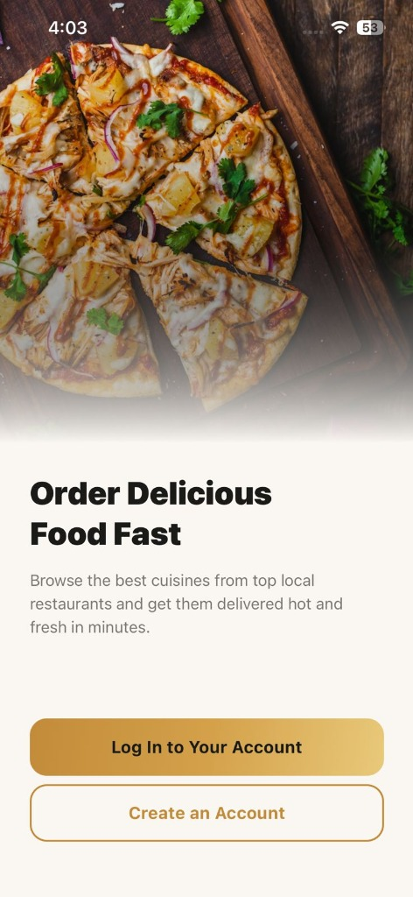
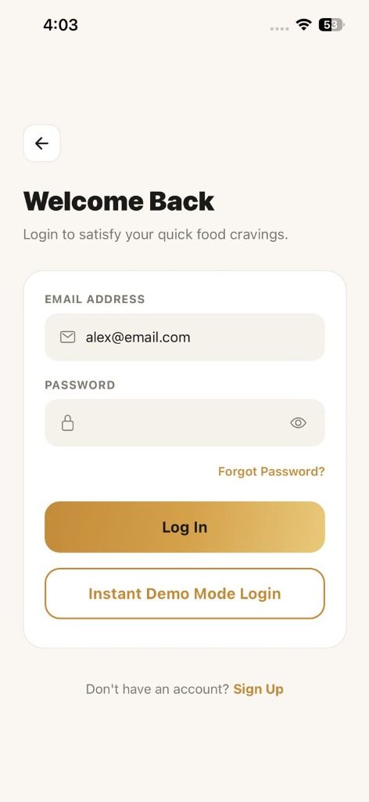
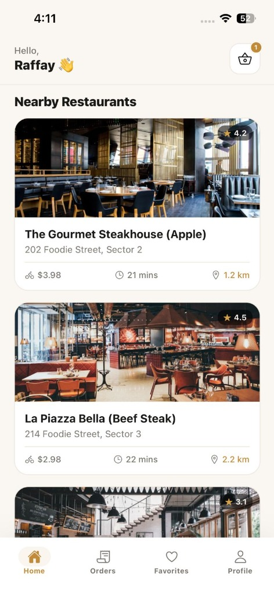
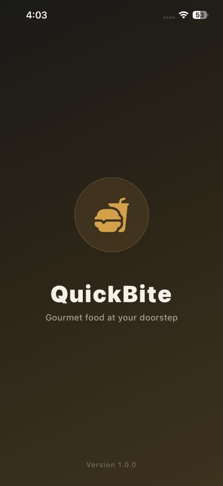

# ✨ QuickBite Food Delivery App ✨

[](https://reactnative.dev)
[](https://expo.dev)
[](https://firebase.google.com)
[](https://react-native-async-storage.github.io/async-storage/)

Welcome to **QuickBite**, a premium high-fidelity Food Delivery application built for mobile platforms using **React Native**, **Expo SDK 51**, **Firebase Authentication**, **Cloud Firestore**, and **AsyncStorage**. 

This application provides a highly polished, buttery-smooth UX featuring responsive modern typography, sleek fluid layouts, and complete offline/online fallback synchronization.

---

## 📸 App Screenshots

<div align="center">
  <table border="0">
    <tr>
      <td align="center" valign="top">
        <p><b>✨ Onboarding & Welcome</b></p>
        
      </td>
      <td align="center" valign="top">
        <p><b>🔒 Authentication System</b></p>
        
      </td>
      <td align="center" valign="top">
        <p><b>🍔 Live Restaurant Feed</b></p>
        
      </td>
      <td align="center" valign="top">
        <p><b>🚀 App Splash Screen</b></p>
        
      </td>
    </tr>
  </table>
</div>

---

## 🛠️ Features & Architectural Map

Below is a detailed matrix mapping every core academic exam requirement directly to the clean-architecture module in the codebase:

| Exam Question | Requirement | Technical Implementation | Core Files / Directories |
| :--- | :--- | :--- | :--- |
| **Question 1** | **Firebase Authentication System** | Secure register, login, signout, display names, validation and interactive toasts. | 📂 [screens/LoginScreen.js](screens/LoginScreen.js)<br/>📂 [screens/SignupScreen.js](screens/SignupScreen.js)<br/>📂 [services/firebase.js](services/firebase.js) |
| **Question 2** | **Firebase Database for Orders** | Real-time Cloud Firestore updates synced with orders tab and dynamic listener hooks. | 📂 [services/firebase.js](services/firebase.js)<br/>📂 [screens/OrdersScreen.js](screens/OrdersScreen.js)<br/>📂 [context/CartContext.js](context/CartContext.js) |
| **Question 3** | **AsyncStorage for Favorites** | Complete offline persistence. Add, view, remove, and clear operations retained across app restarts. | 📂 [screens/FavoritesScreen.js](screens/FavoritesScreen.js)<br/>📂 [components/FoodCard.js](components/FoodCard.js) |
| **Question 4** | **API Integration & Fetching** | Dual endpoint integration parsing meals from TheMealDB API and dynamically structuring nearby restaurants. | 📂 [services/api.js](services/api.js)<br/>📂 [screens/DashboardScreen.js](screens/DashboardScreen.js) |
| **Question 5** | **Attractive Modern UI/UX** | Premium glassmorphism styles, active bottom tab pill icons, cohesive theme engine, custom circular avatar. | 📂 [navigation/AppNavigator.js](navigation/AppNavigator.js)<br/>📂 [screens/ProfileScreen.js](screens/ProfileScreen.js) |

---

## ⚙️ Project Structure

```text
QuickBite-Food-Delivery-App/
├── assets/                  # App images, logos, and custom profile assets
│   ├── pfp.png              # Custom localized profile avatar (Raffay)
│   └── screenshots/         # High-resolution README previews
├── components/              # Modular UI elements (FoodCard, CartIcon, CustomButton)
├── context/                 # Context providers (CartContext, ThemeContext)
├── navigation/              # Dynamic stack and modern bottom tab navigations
├── screens/                 # Premium screen flows (Home, Detail, Cart, Favorites, Auth)
└── services/                # Backend layer
    ├── api.js               # Online APIs integration
    └── firebase.js          # Unified Firestore and Auth persistence layer
```

---

## 🚀 Setup & Installation Instructions

Follow these quick commands to spin up the application on your computer:

### 1. Clone the repository
```bash
git clone https://github.com/tech-raffay/QuickBite-Food-Delivery-App.git
cd QuickBite-Food-Delivery-App
```

### 2. Install dependencies
```bash
npm install
```

### 3. Initialize Expo Server
```bash
npm start
```
* Press `a` to run on an Android Device/Emulator.
* Press `i` to run on an iOS Simulator.
* Scan the QR code with the **Expo Go** app to run instantly on your physical phone!

---

## 🔒 Cloud Database Config
All operations connect to your Firebase database **`food-app-raffay`** targeting the custom collection **`quickBitecollection`**. The app handles connection failures gracefully by automatically utilizing mirrored `AsyncStorage` fallbacks so your users experience absolute zero downtime!

---
<div align="center">
  <sub>Developed with ❤️ for Raffay's Startup Food Service.</sub>
</div>
